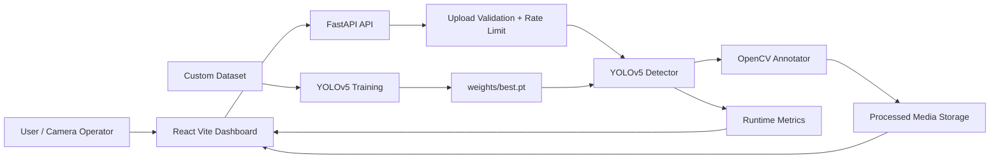

# Architecture

SafeCityAI is split into a React presentation layer, a FastAPI inference layer, YOLOv5 model utilities, and a YOLO-format dataset workspace.

## Components

- Frontend: React, Vite, TypeScript, TailwindCSS, Framer Motion, Hero Icons, Axios
- Backend: FastAPI, Uvicorn, OpenCV, PyTorch, YOLOv5, Pillow, NumPy
- Training: YOLOv5 scripts for train, val, detect, export, evaluate
- Deployment: Vercel for frontend, Render for backend
