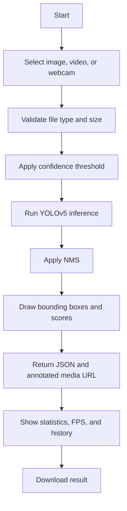

# Flowchart

```mermaid
flowchart TD
  A["Start"] --> B["Select image, video, or webcam"]
  B --> C["Validate file type and size"]
  C --> D["Apply confidence threshold"]
  D --> E["Run YOLOv5 inference"]
  E --> F["Apply NMS"]
  F --> G["Draw bounding boxes and scores"]
  G --> H["Return JSON and annotated media URL"]
  H --> I["Show statistics, FPS, and history"]
  I --> J["Download result"]
```
