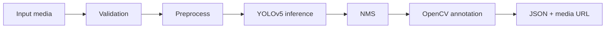
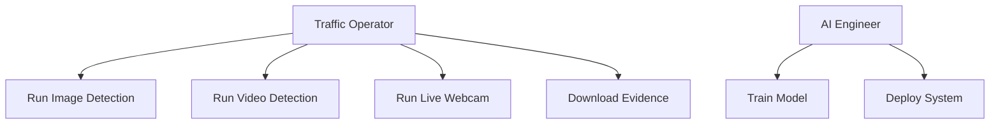
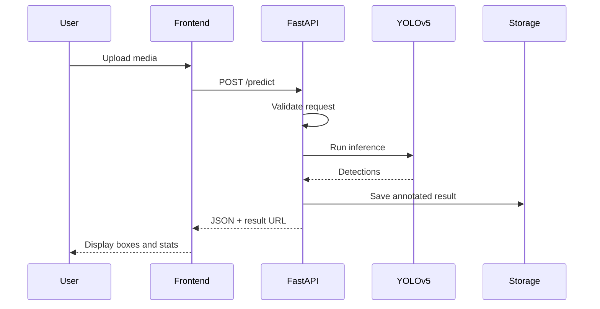
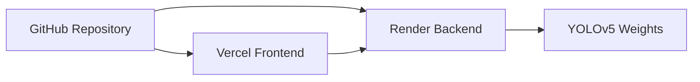

# SafeCityAI Diagrams

## Pipeline Diagram

```mermaid
flowchart LR
  A["Input media"] --> B["Validation"]
  B --> C["Preprocess"]
  C --> D["YOLOv5 inference"]
  D --> E["NMS"]
  E --> F["OpenCV annotation"]
  F --> G["JSON + media URL"]
```

## Use Case Diagram

```mermaid
flowchart TB
  Operator["Traffic Operator"] --> Image["Run Image Detection"]
  Operator --> Video["Run Video Detection"]
  Operator --> Webcam["Run Live Webcam"]
  Operator --> Download["Download Evidence"]
  Admin["AI Engineer"] --> Train["Train Model"]
  Admin --> Deploy["Deploy System"]
```

## Sequence Diagram

```mermaid
sequenceDiagram
  participant U as User
  participant F as Frontend
  participant A as FastAPI
  participant M as YOLOv5
  participant S as Storage
  U->>F: Upload media
  F->>A: POST /predict
  A->>A: Validate request
  A->>M: Run inference
  M-->>A: Detections
  A->>S: Save annotated result
  A-->>F: JSON + result URL
  F-->>U: Display boxes and stats
```

## Deployment Diagram

```mermaid
flowchart LR
  GitHub["GitHub Repository"] --> Vercel["Vercel Frontend"]
  GitHub --> Render["Render Backend"]
  Vercel --> Render
  Render --> Weights["YOLOv5 Weights"]
```
